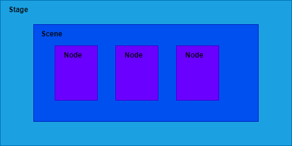

# Scene类

## 窗口结构



* scene类基本使用
  
    ```java
    Button button = new Button("Hello World");  
    Group group = new Group();  
    group.getChildren().add(button);  
    Scene scene = new Scene(group);  
    primaryStage.setScene(scene);  
    primaryStage.setTitle("JavaFX");  
    primaryStage.setWidth(500);  
    primaryStage.setHeight(500);  
    primaryStage.show();
    ```

    

* 修改鼠标样式 `scene.setCursor(Cursor.HAND);`

* 用图片设置鼠标样式
  
    ```java
    URL resource = getClass().getClassLoader().getResource("images/p.png");  
    String cursor = resource.toExternalForm();  
    scene.setCursor(Cursor.cursor(cursor));
    ```

* 默认浏览器打开网页
  
    ```java
    HostServices hostServices = getHostServices();  
    hostServices.showDocument("https://www.baidu.com");
    ```