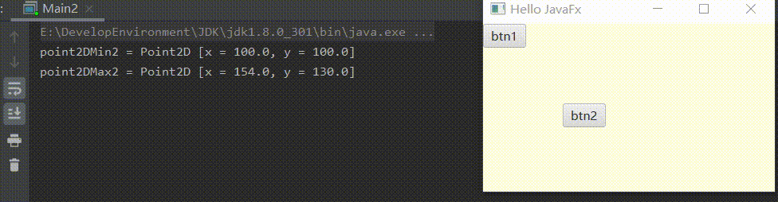

### 宽高、坐标、边界问题

#### 宽高相关

* 查看组件宽高是否能由父组件调整`button.isResizable()`

* 当组件可由父节点调整时，可以使用下面两个方法设置宽高
  
  * 设置宽度`button.setPrefWidth(100);`
    * 设置组件自动宽度（默认）`button.setPrefWidth(Button.USE_COMPUTED_SIZE);`
    * 设置组件最小宽度`button.setPrefWidth(Button.USE_PREF_SIZE);`
  * 设置高度`button.setPrefHeight(100);`
    * （与宽度同理）

* 当组件可不能由父节点调整时，可以使用下面两个方法设置宽高
  
  * 设置宽度`rectangle.setWidth(100);`
  * 设置高度`rectangle.setHeight(100);`

* 设置了PrefWidth会影响Width，未设置PrefWidth会显示-1.0
  
```java
System.out.println("button.getPrefWidth() = " + button.getPrefWidth());  
System.out.println("button.getWidth() = " + button.getWidth());
```
  
> button.getPrefWidth() = -1.0  
> button.getWidth() = 45.0

* 确定组件的首选高度`button.prefHeight(-1)`

* 确定组件宽度或高度依赖的方向`button.getContentBias()`
  
#### 坐标相关

* 获取组件左上角在父组件内的坐标
  
```java
System.out.println("button.getLayoutX() = " + button.getLayoutX());  
System.out.println("button.getLayoutY() = " + button.getLayoutY());
```

* 获取组件相较于本身坐标系的坐标
  
```java
Bounds bounds = button.getLayoutBounds();  
System.out.println("左上角坐标：(" + bounds.getMinX() + "," + bounds.getMinY() + ")");  
System.out.println("右下角坐标：(" + bounds.getMaxX() + "," + bounds.getMaxY() + ")");  
System.out.println("宽度：" + bounds.getWidth());  
System.out.println("高度：" + bounds.getHeight());
```

* 将坐标转换为相对于父组件的坐标
  
```java
Point2D point1 = button.localToParent(bounds.getMinX(), bounds.getMinY());  
System.out.println("在父组件中按钮的左上角坐标为 " + point1);
```

* 将坐标转换为相对于整个场景的坐标
  
```java
Point2D point2 = button.localToScene(bounds.getMinX(), bounds.getMinY());  
System.out.println("在整个场景中按钮的左上角坐标为 " + point2);
```

* 将坐标转换为相对于整个屏幕的坐标
  
```java
Point2D point3 = button.localToScreen(bounds.getMinX(), bounds.getMinY());  
System.out.println("在整个屏幕中按钮的左上角坐标为 " + point3);
```

* 将相对于父组件的坐标转换为相对于本身的右下角坐标
  
```java
Point2D point4 = button.parentToLocal(point1.getX(), point1.getY());  
System.out.println("在按钮中按钮的右下角坐标为 " + "(" + (point4.getX() + button.getWidth()) + "," + (point4.getY() + button.getHeight()) + ")");
```

* 将相对于整个场景的坐标转换为相对于本身的右下角坐标
  
```java
Point2D point5 = button.sceneToLocal(point2.getX(), point2.getY());  
System.out.println("在按钮中按钮的右下角坐标为 " + "(" + (point5.getX() + button.getWidth()) + "," + (point5.getY() + button.getHeight()) + ")");
```

* 判断是否包含某个点
  
```java
System.out.println("bounds.contains(10, 10) = " + bounds.contains(10, 10));
```
  
#### 判断两个组件之间是否接触到
1. 创建两个按钮
   
   ```java
   Button button1 = new Button("btn1");  
   Button button2 = new Button("btn2");
   ```

2. 设置按钮位置与设置布局
   
   ```java
   AnchorPane.setTopAnchor(button2, 100.0);  
   AnchorPane.setLeftAnchor(button2, 100.0);  
   anchorPane.getChildren().addAll(button2, button1);
   ```

3. 获取按钮2相关坐标
   
   ```java
   Bounds bounds2 = button2.getLayoutBounds();  
   // 获取控件左上角在父组件内的坐标  
   // button2左上角坐标  
   Point2D point2DMin2 = button2.localToParent(bounds2.getMinX(), bounds2.getMinY());  
   // button2右下角坐标  
   Point2D point2DMax2 = button2.localToParent(bounds2.getMaxX(), bounds2.getMaxY());
   ```

4. 获取按钮1相关坐标
   
   ```java
   Bounds bounds1 = button1.getLayoutBounds();
   ```

5. 键盘事件
   
   ```java
   scene.setOnKeyPressed(new EventHandler<KeyEvent>() {  
    // Button1左上角坐标  
    Point2D point2DMin1 = null;  
    // Button1右下角坐标  
    Point2D point2DMax1 = null;  
    @Override  
    public void handle(KeyEvent event) {  
        if (event.getCode() == KeyCode.D) {  
            x += 10.0;  
            button1.setLayoutX(x);  
        } else if (event.getCode() == KeyCode.A) {  
            x -= 10.0;  
            button1.setLayoutX(x);  
        } else if (event.getCode() == KeyCode.W) {  
            y -= 10.0;  
            button1.setLayoutY(y);  
        } else if (event.getCode() == KeyCode.S) {  
            y += 10.0;  
            button1.setLayoutY(y);  
        }  
        point2DMin1 = button1.localToParent(bounds1.getMinX(), bounds1.getMinY());  
        point2DMax1 = button1.localToParent(bounds1.getMaxX(), bounds1.getMaxY());  
        // 左上角小于右下角并且右下角大于左上角  
        if (point2DMin1.getX() <= point2DMax2.getX() && point2DMin1.getY() <= point2DMax2.getY() && point2DMax1.getX() >= point2DMin2.getX() && point2DMax1.getY() >= point2DMin2.getY()) {  
            System.out.println("Button1 与 Button2 接触" + times++);  
        }  
    }  
   });
   ```
   
   
   
#### 组件边界宽高
* 获取宽高
  
```java
System.out.println(button.getLayoutBounds()); // 边界  
System.out.println(button.getBoundsInLocal()); // 局部边界  
System.out.println(button.getBoundsInParent()); // 父边界
```
  
> BoundingBox [minX:0.0, minY:0.0, minZ:0.0, width:69.0, height:30.0, depth:0.0, maxX:69.0, maxY:30.0, maxZ:0.0]  
> BoundingBox [minX:0.0, minY:0.0, minZ:0.0, width:69.0, height:31.0, depth:0.0, maxX:69.0, maxY:31.0, maxZ:0.0]  
> BoundingBox [minX:100.0, minY:100.0, minZ:0.0, width:69.0, height:31.0, depth:0.0, maxX:169.0, maxY:131.0, maxZ:0.0]

* 设置阴影后获取宽高
  
```java
button.setEffect(new DropShadow());
```
  
> BoundingBox [minX:0.0, minY:0.0, minZ:0.0, width:69.0, height:30.0, depth:0.0, maxX:69.0, maxY:30.0, maxZ:0.0]  
> BoundingBox [minX:-9.0, minY:-9.0, minZ:0.0, width:87.0, height:49.0, depth:0.0, maxX:78.0, maxY:40.0, maxZ:0.0]  
> BoundingBox [minX:91.0, minY:91.0, minZ:0.0, width:87.0, height:49.0, depth:0.0, maxX:178.0, maxY:140.0, maxZ:0.0]

* 旋转组件后获取宽高
  
```java
button.setRotate(45.0);
```
  
> BoundingBox [minX:0.0, minY:0.0, minZ:0.0, width:69.0, height:30.0, depth:0.0, maxX:69.0, maxY:30.0, maxZ:0.0]  
> BoundingBox [minX:-9.0, minY:-9.0, minZ:0.0, width:87.0, height:49.0, depth:0.0, maxX:78.0, maxY:40.0, maxZ:0.0]  
> BoundingBox [minX:86.06318664550781, minY:67.27029418945312, minZ:0.0, width:96.16651916503906, height:96.16651916503906, depth:0.0, maxX:182.22970581054688, maxY:163.4368133544922, maxZ:0.0]