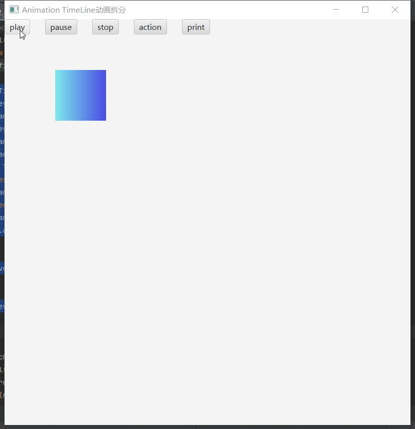
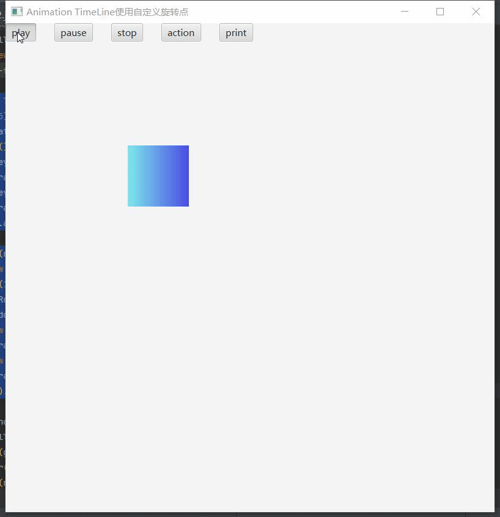

# AnimationTimeLine动画组合

## 多属性组合

```java
Timeline timeline = new Timeline();  
KeyValue translateX0 = new KeyValue(rectangle.translateXProperty(), 0);// x轴位移  
KeyValue rotate0 = new KeyValue(rectangle.rotateProperty(), 0); // 旋转  
KeyValue scaleX0 = new KeyValue(rectangle.scaleXProperty(), 1); // x轴缩放  
KeyValue scaleY0 = new KeyValue(rectangle.scaleYProperty(), 1); // y轴缩放  
KeyValue opacity0 = new KeyValue(rectangle.opacityProperty(), 1); // 透明度  
KeyFrame kf0 = new KeyFrame(Duration.seconds(0), translateX0, rotate0, scaleX0, scaleY0, opacity0);  
KeyValue translateX1 = new KeyValue(rectangle.translateXProperty(), 300);  
KeyValue rotate1 = new KeyValue(rectangle.rotateProperty(), 360);  
KeyValue scaleX1 = new KeyValue(rectangle.scaleXProperty(), 2);  
KeyValue scaleY1 = new KeyValue(rectangle.scaleYProperty(), 2);  
KeyValue opacity1 = new KeyValue(rectangle.opacityProperty(), 0);  
KeyFrame kf1 = new KeyFrame(Duration.seconds(3), translateX1, rotate1, scaleX1, scaleY1, opacity1);  
timeline.getKeyFrames().addAll(kf0, kf1);  
timeline.setCycleCount(2);  
timeline.setAutoReverse(true);
```


## 多属性异步变化

```java
Timeline timeline = new Timeline();  
ObservableList<KeyFrame> keyFrames = timeline.getKeyFrames();  
timeline.setCycleCount(2);  
timeline.setAutoReverse(true);  
KeyValue rotate0 = new KeyValue(rectangle.rotateProperty(), 0);// 旋转  
KeyFrame kf0 = new KeyFrame(Duration.seconds(0), rotate0);  
keyFrames.add(kf0);  
KeyValue rotate1 = new KeyValue(rectangle.rotateProperty(), 360);// 旋转  
KeyFrame kf1 = new KeyFrame(Duration.seconds(1), rotate1);  
keyFrames.add(kf1);  
KeyValue translateX0 = new KeyValue(rectangle.translateXProperty(), 0);// x轴平移  
KeyFrame kf2 = new KeyFrame(Duration.seconds(1), translateX0);  
keyFrames.add(kf2);  
KeyValue translateX1 = new KeyValue(rectangle.translateXProperty(), 300);// x轴平移  
KeyFrame kf3 = new KeyFrame(Duration.seconds(2), translateX1);  
keyFrames.add(kf3);  
KeyValue rotate2 = new KeyValue(rectangle.rotateProperty(), 360);// 旋转  
KeyFrame kf4 = new KeyFrame(Duration.seconds(2), rotate2);  
keyFrames.add(kf4);  
KeyValue rotate3 = new KeyValue(rectangle.rotateProperty(), 0);// 旋转  
KeyFrame kf5 = new KeyFrame(Duration.seconds(3), rotate3);  
keyFrames.add(kf5);  
KeyValue rotate4 = new KeyValue(rectangle.rotateProperty(), 0);// 旋转  
KeyFrame kf6 = new KeyFrame(Duration.seconds(4), rotate4);  
keyFrames.add(kf6);
```


## 动画拆分

```java
Timeline timeline = new Timeline();  
KeyValue rotate0 = new KeyValue(rectangle.rotateProperty(), 0);// 旋转  
KeyFrame kf0 = new KeyFrame(Duration.seconds(0), rotate0);  
KeyValue rotate1 = new KeyValue(rectangle.rotateProperty(), 360);// 旋转  
KeyFrame kf1 = new KeyFrame(Duration.seconds(1), rotate1);  
timeline.getKeyFrames().addAll(kf0, kf1);  
Timeline timeline1 = new Timeline();  
KeyValue translateX0 = new KeyValue(rectangle.translateXProperty(), 0);// x轴平移  
KeyFrame kf2 = new KeyFrame(Duration.seconds(0), translateX0);  
KeyValue translateX1 = new KeyValue(rectangle.translateXProperty(), 300);// x轴平移  
KeyFrame kf3 = new KeyFrame(Duration.seconds(1), translateX1);  
timeline1.getKeyFrames().addAll(kf2, kf3);  
timeline.setOnFinished(event -> {  
    timeline1.play();  
});  
```



## 使用自定义缩放点

```java
Timeline timeline = new Timeline();  
timeline.setAutoReverse(true);  
timeline.setCycleCount(Timeline.INDEFINITE);  
Scale scale = new Scale(1, 1, 100, 100);  
rectangle.getTransforms().add(scale);  
KeyValue scale1x = new KeyValue(scale.xProperty(), 2);  
KeyValue scale1y = new KeyValue(scale.yProperty(), 2);  
KeyFrame kf1 = new KeyFrame(Duration.seconds(0), scale1x, scale1y);  
KeyValue scale2x = new KeyValue(scale.xProperty(), 0.5);  
KeyValue scale2y = new KeyValue(scale.yProperty(), 0.5);  
KeyFrame kf2 = new KeyFrame(Duration.seconds(1), scale2x, scale2y);  
timeline.getKeyFrames().addAll(kf1, kf2);
```


## 使用自定义旋转点

```java
Timeline timeline = new Timeline();  
timeline.setCycleCount(5);  
Rotate rotate = new Rotate(0, 50, 50);  
rectangle.getTransforms().add(rotate);  
KeyValue angle1 = new KeyValue(rotate.angleProperty(), 0);  
KeyFrame kf1 = new KeyFrame(Duration.seconds(0), angle1);  
KeyValue angle2 = new KeyValue(rotate.angleProperty(), 360);  
KeyFrame kf2 = new KeyFrame(Duration.seconds(1), angle2);  
timeline.getKeyFrames().addAll(kf1, kf2);  
Group group = new Group(rectangle);  
Timeline timeline1 = new Timeline();  
timeline1.setCycleCount(1);  
Rotate rotateOut = new Rotate(0, 200, 200);  
group.getTransforms().add(rotateOut);  
KeyValue angle1Out = new KeyValue(rotateOut.angleProperty(), 0);  
KeyFrame kf3 = new KeyFrame(Duration.seconds(0), angle1Out);  
KeyValue angle2Out = new KeyValue(rotateOut.angleProperty(), 360);  
KeyFrame kf4 = new KeyFrame(Duration.seconds(5), angle2Out);  
timeline1.getKeyFrames().addAll(kf3, kf4);
```

