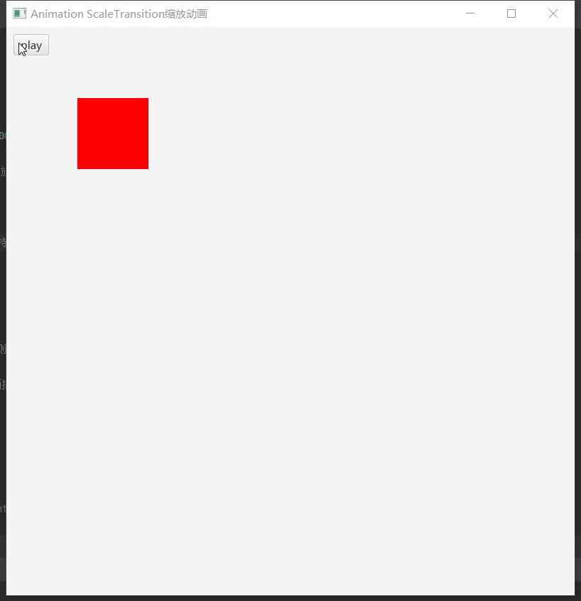

# Animation ScaleTransition缩放动画

* 创建缩放动画`ScaleTransition st = new ScaleTransition();`

* 设置动画持续时间`st.setDuration(Duration.seconds(3));`

* 设置动画的节点`st.setNode(rectangle);`

* 设置起始比例
      
    ```java
    st.setFromX(1);// 起始比例  
    st.setFromY(1);
    ```

* 设置终止比例
    
    ```java
    st.setToX(2);// 终止比例  
    st.setToY(0.5);
    ```

* 每次缩放的比例**如果和setTo同时存在，则该设置无效**
    
    ```java
    st.setByX(1);// 每次缩放的比例，如果和setTo同时存在，则该设置无效  
    st.setByY(-0.5);
    ```

* 设置动画插值器`st.setInterpolator(Interpolator.LINEAR);`

