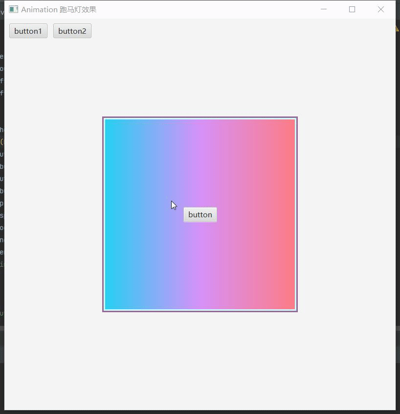

### Animation 跑马灯效果

1. 界面布局
  
   ```java
   StackPane sp = new StackPane();  
   sp.setPrefSize(400, 400);  
   sp.setStyle("-fx-border-color: #996699; -fx-border-style: solid; -fx-border-width: 3;"); 
   
    HBox hBox = new HBox();  
    hBox.setAlignment(Pos.CENTER);  
    String background = "-fx-background-color: linear-gradient(from 0.0% 0.0% to 100.0% 0.0%, #bb96e1ff 0.0%, #5c56bbff 100.0%);";  
    String border = "-fx-border-color: #ffffcc; -fx-border-width: 3; -fx-border-style: solid;";  
    hBox.setStyle(background + border);  
    sp.getChildren().add(hBox);  
   
    HBox hBox1 = new HBox();  
    hBox1.setAlignment(Pos.CENTER);  
    String background1 = "-fx-background-color: linear-gradient(from 0.0% 0.0% to 100.0% 0.0%, #23d0f3ff 0.0%, #d791f9ff 50.0%, #fe7b84ff 100.0%);";  
    String border1 = "-fx-border-color: #ccffff; -fx-border-width: 3; -fx-border-style: solid;";  
    hBox1.setStyle(background1 + border1);
   ```

2. 创建置换效果
  
   ```java
   // 置换效果  
   DisplacementMap displacementMap = new DisplacementMap();  
   displacementMap.setWrap(true);  
   hBox1.setEffect(displacementMap);
   ```

3. 模拟位移
  
   ```java
   // 模拟位移组件  
   Button simulation = new Button("simulation");  
   // 位移动画  
   TranslateTransition tt = new TranslateTransition();  
   tt.setDuration(Duration.seconds(3));  
   tt.setNode(simulation);  
   tt.setFromX(0);  
   tt.setToX(400);  
   // tt.setByX(400);  
   tt.setCycleCount(Animation.INDEFINITE);// 循环播放  
   tt.setInterpolator(Interpolator.LINEAR);// 动画插值器，匀速  
   // 播放完成  
   tt.setOnFinished(event -> {  
       // sp.getChildren().remove(hBox1);// 移除此组件  
       // hBox1.setVisible(false);// 设置该组件不可见  
       // hBox1.toBack();// 设置该组件位于最底层  
   });
   ```

4. 监听模拟位移组件的x轴方向位移量的变化
  
   ```java
   // 方式1：监听器
   simulation.translateXProperty().addListener((observable, oldValue, newValue) -> {  
       double x = newValue.doubleValue();  
       displacementMap.setOffsetX(-(x / sp.getWidth()));  
   });
   // 方式2：绑定
   DoubleProperty tx = simulation.translateXProperty();  
   DoubleBinding res = tx.divide(sp.widthProperty()).multiply(-1);  
   displacementMap.offsetXProperty().bind(res);
   ```
   
   
   
   #### 实例（切换界面显示）

5. 创建2个置换效果分别设置于hBox和hBox1
  
   ```java
   // 置换效果  
   DisplacementMap displacementMap = new DisplacementMap(); 
   hBox1.setEffect(displacementMap);  
   DisplacementMap displacementMap1 = new DisplacementMap(); 
   hBox.setEffect(displacementMap1);  
   hBox.toBack();// 置底
   ```

6. 模拟位移
  
   ```java
   // 模拟位移组件  
   Button simulation = new Button("simulation");  
   // 位移动画  
   TranslateTransition tt = new TranslateTransition();  
   tt.setDuration(Duration.seconds(3));  
   tt.setNode(simulation);  
   // 播放完成  
   tt.setOnFinished(event -> {  
       // 如果hBox1没有进行移动，则将hBox1置顶  
       if (displacementMap.getOffsetX() >= -0.01 && displacementMap.getOffsetX() <= 0.01) {  
           hBox1.toFront();  
       }  
       // 如果hBox显示与窗口中，则将hBox置顶  
       if (displacementMap1.getOffsetX() >= -0.01 && displacementMap1.getOffsetX() <= 0.01) {  
           hBox.toFront();  
       }  
   });
   ```

7. 监听（同理可使用绑定进行操作）
  
   ```java
   simulation.translateXProperty().addListener((observable, oldValue, newValue) -> {  
       double x = newValue.doubleValue();  
       displacementMap.setOffsetX(-(x / sp.getWidth()));  
       displacementMap1.setOffsetX(1 - (x / sp.getWidth()));  
   });
   ```

8. 按钮点击事件
  
   ```java
   button1.setOnAction(event -> {  
       System.out.println("button1");  
       tt.setFromX(0);  
       tt.setToX(400);  
       tt.play();  
   });  
   button2.setOnAction(event -> {  
       System.out.println("button2");  
       tt.setFromX(400);  
       tt.setToX(0);  
       tt.play();  
   });
   ```
   
   